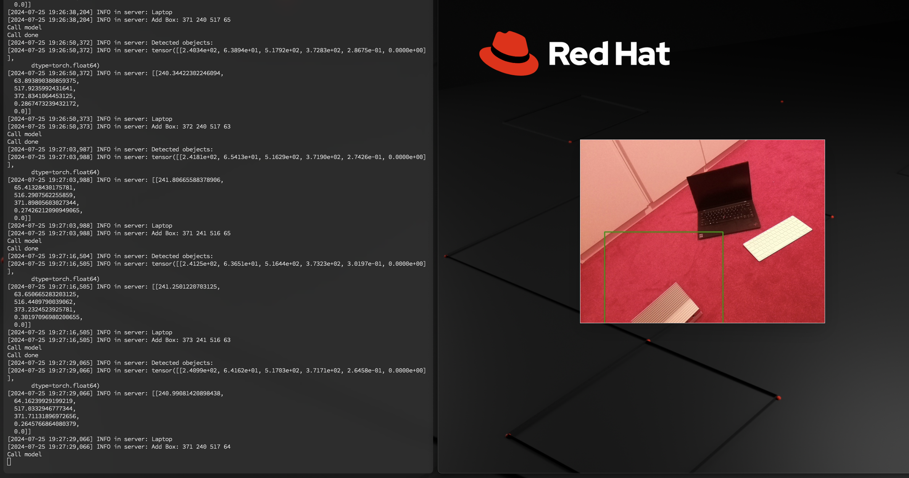

# Robo Hackthon Demo / Test App

Simple web app show camera image boxes ;-)



## Build image

```bash
export IMAGE='quay.io/cloud-native-robotz-hackathon/human-driver-webapp:latest'    
podman build --platform linux/amd64,linux/arm64  --manifest ${IMAGE}  .  
podman manifest push ${IMAGE}
```

## Deployment


```bash
oc apply -k deployment/
```

## Local development

```bash
# Build
podman build -t foo .   
# Run
podman run -ti --rm -p 5001:5000 -v $(pwd):/app:Z foo ./run.sh 
```